# EducationAI

```
    ███████╗██████╗ ██╗   ██╗ ██████╗ █████╗ ████████╗██╗ ██████╗ ███╗   ██╗
    ██╔════╝██╔══██╗██║   ██║██╔════╝██╔══██╗╚══██╔══╝██║██╔═══██╗████╗  ██║
    █████╗  ██║  ██║██║   ██║██║     ███████║   ██║   ██║██║   ██║██╔██╗ ██║
    ██╔══╝  ██║  ██║██║   ██║██║     ██╔══██║   ██║   ██║██║   ██║██║╚██╗██║
    ███████╗██████╔╝╚██████╔╝╚██████╗██║  ██║   ██║   ██║╚██████╔╝██║ ╚████║
    ╚══════╝╚═════╝  ╚═════╝  ╚═════╝╚═╝  ╚═╝   ╚═╝   ╚═╝ ╚═════╝ ╚═╝  ╚═══╝
                    █████╗ ██╗
                   ██╔══██╗██║
                   ███████║██║
                   ██╔══██║██║
                   ██║  ██║██║
                   ╚═╝  ╚═╝╚═╝
```

<div align="center">

[](https://swift.org)
[](https://github.com/muhittincamdali/educationai/actions)[](https://developer.apple.com/ios/)
[](https://github.com/muhittincamdali/educationai/actions)[](https://developer.apple.com/macos/)
[](https://github.com/muhittincamdali/educationai/actions)[](https://swift.org/package-manager/)
[](https://github.com/muhittincamdali/educationai/actions)[](LICENSE)
[](https://github.com/muhittincamdali/educationai/actions)[]()
[](https://github.com/muhittincamdali/educationai/actions)
**Intelligent tutoring system powered by on-device machine learning**

Build adaptive learning experiences with personalized quiz generation, real-time progress tracking, and Apple Intelligence integration.

[Features](#features) • [Installation](#installation) • [Quick Start](#quick-start) • [CoreML Integration](#coreml-integration) • [Examples](#examples)

</div>

---

## Features

| Feature | Description |
|---------|-------------|
| 🎯 **Adaptive Learning** | Dynamically adjusts difficulty based on learner performance |
| 🤖 **Intelligent Tutoring** | Personalized guidance and hints powered by on-device ML |
| 📝 **Quiz Generation** | Creates assessments tailored to individual skill gaps |
| 📊 **Progress Analytics** | Deep insights into learning patterns and outcomes |
| 🧠 **CoreML Powered** | Privacy-first, on-device inference for real-time feedback |
| 🍎 **Apple Intelligence** | Native integration with iOS 18 intelligence features |
| ⚡ **Async/Await** | Modern Swift concurrency throughout the API |
| 🔒 **Privacy First** | All processing happens on-device |

---

## How It Works

```mermaid
flowchart TD
    A[👤 Learner] --> B[📱 Start Session]
    B --> C{🧠 Skill Assessment}
    C --> D[📊 Analyze Knowledge Gaps]
    D --> E[🎯 Generate Learning Path]
    E --> F[📚 Deliver Content]
    F --> G{📝 Quiz Time}
    G -->|Correct| H[⬆️ Increase Difficulty]
    G -->|Incorrect| I[💡 Provide Hints]
    H --> J[🏆 Track Progress]
    I --> K[🔄 Adaptive Review]
    K --> F
    J --> L{🎓 Mastery Achieved?}
    L -->|No| F
    L -->|Yes| M[✅ Complete Module]
    M --> N[📈 Update Skill Profile]
    N --> E
```



---

## Installation

### Swift Package Manager

```swift
dependencies: [
    .package(url: "https://github.com/muhittincamdali/educationai.git", from: "1.0.0")
]
```

```swift
.target(
    name: "YourApp",
    dependencies: ["EducationAI"]
)
```

### Xcode

1. **File → Add Package Dependencies**
2. Enter `https://github.com/muhittincamdali/educationai.git`
3. Select version and add to your target

---

## Quick Start

### Initialize the Learning Engine

```swift
import EducationAI

let engine = LearningEngine()

// Configure with custom parameters
let config = LearningConfig(
    adaptiveMode: .aggressive,
    difficultyRange: 1...10,
    retentionInterval: .spaced
)
let engine = LearningEngine(config: config)
```

### Run Skill Assessment

```swift
// Assess learner's current knowledge
let assessment = try await engine.assessSkills(
    learner: learnerId,
    subject: .mathematics,
    depth: .comprehensive
)

print("Skill Level: \(assessment.level)")       // beginner/intermediate/advanced
print("Confidence: \(assessment.confidence)%")  // 0-100
print("Gaps: \(assessment.knowledgeGaps)")      // Areas needing focus
```

### Generate Adaptive Quiz

```swift
// Create personalized quiz based on skill gaps
let quiz = try await engine.generateQuiz(
    for: learnerId,
    topic: "Linear Algebra",
    questionCount: 10,
    adaptiveDifficulty: true
)

for question in quiz.questions {
    print("Q: \(question.text)")
    print("Difficulty: \(question.difficulty)/10")
    print("Targets: \(question.targetedSkills)")
}
```

### Track Learning Progress

```swift
// Get detailed progress analytics
let progress = try await engine.analyzeProgress(
    learner: learnerId,
    timeframe: .lastMonth
)

print("Mastery: \(progress.masteryPercentage)%")
print("Study Time: \(progress.totalMinutes) min")
print("Streak: \(progress.currentStreak) days")
print("Velocity: \(progress.learningVelocity)")  // items/hour
```

---

## CoreML Integration

EducationAI uses on-device machine learning for privacy-preserving personalization.

### Skill Prediction Model

```swift
import CoreML
import EducationAI

// Load the bundled skill prediction model
let predictor = try SkillPredictor()

// Predict optimal next topic
let prediction = try predictor.predict(
    recentScores: [85, 72, 90, 68],
    timeSpent: [15, 22, 10, 30],  // minutes per topic
    topicEmbeddings: currentTopicVector
)

print("Recommended Topic: \(prediction.nextTopic)")
print("Predicted Score: \(prediction.expectedScore)%")
print("Optimal Study Duration: \(prediction.suggestedMinutes) min")
```

### Training Custom Models with CreateML

```swift
import CreateML
import EducationAI

// Prepare training data from learner interactions
let trainingData = LearnerDataset(
    interactions: historicalData,
    outcomes: assessmentResults
)

// Train personalized difficulty model
let model = try DifficultyClassifier.train(
    data: trainingData,
    parameters: .init(
        iterations: 100,
        validationSplit: 0.2
    )
)

// Export for on-device use
try model.write(to: modelURL)

// Load in your app
let customPredictor = try DifficultyPredictor(modelURL: modelURL)
```

### Model Architecture

```
┌─────────────────────────────────────────────────────────┐
│                    EducationAI Models                   │
├─────────────────────────────────────────────────────────┤
│                                                         │
│  ┌─────────────┐    ┌─────────────┐    ┌────────────┐  │
│  │   Skill     │    │  Difficulty │    │  Content   │  │
│  │  Predictor  │    │  Classifier │    │ Recommender│  │
│  │   (5.2MB)   │    │   (2.1MB)   │    │  (8.4MB)   │  │
│  └──────┬──────┘    └──────┬──────┘    └─────┬──────┘  │
│         │                  │                  │         │
│         └──────────────────┼──────────────────┘         │
│                            │                            │
│                   ┌────────▼────────┐                   │
│                   │  Learning Engine │                   │
│                   │   Orchestrator   │                   │
│                   └─────────────────┘                   │
│                                                         │
└─────────────────────────────────────────────────────────┘
```

---

## Apple Intelligence Integration

Leverage iOS 18+ Apple Intelligence features for enhanced learning experiences.

### Writing Tools Integration

```swift
import EducationAI

// Generate study notes with Apple Intelligence
let notes = try await engine.generateStudyNotes(
    topic: "Quantum Mechanics",
    style: .concise,
    useAppleIntelligence: true
)

// Summarize lengthy content
let summary = try await engine.summarize(
    content: lectureTranscript,
    length: .brief
)
```

### Siri Integration

```swift
// App Intents for Siri
struct StartLearningIntent: AppIntent {
    static var title: LocalizedStringResource = "Start Learning Session"
    
    @Parameter(title: "Subject")
    var subject: String
    
    func perform() async throws -> some IntentResult {
        let engine = LearningEngine.shared
        let session = try await engine.startSession(subject: subject)
        return .result(dialog: "Starting \(subject) session. You have \(session.pendingItems) items to review.")
    }
}
```

### Focus Filters

```swift
// Adjust content based on Focus mode
class LearningFocusFilter: SetFocusFilterIntent {
    @Parameter(title: "Study Mode")
    var studyMode: StudyMode
    
    func perform() async throws -> some IntentResult {
        LearningEngine.shared.setFocusMode(studyMode)
        return .result()
    }
}
```

### Live Activities

```swift
import ActivityKit
import EducationAI

// Show learning progress as Live Activity
struct LearningActivityAttributes: ActivityAttributes {
    let subject: String
    
    struct ContentState: Codable, Hashable {
        var progress: Double
        var currentTopic: String
        var streak: Int
    }
}

// Start activity when learning session begins
let activity = try Activity.request(
    attributes: LearningActivityAttributes(subject: "Swift"),
    content: .init(state: initialState, staleDate: nil)
)
```

---

## Advanced Usage

### Spaced Repetition

```swift
// Configure spaced repetition algorithm
let scheduler = SpacedRepetitionScheduler(
    algorithm: .sm2,  // SuperMemo 2 algorithm
    minimumInterval: .hours(4),
    maximumInterval: .days(365)
)

// Schedule review for item
let nextReview = scheduler.schedule(
    item: flashcard,
    rating: .good,  // again/hard/good/easy
    previousInterval: .days(3)
)

print("Next review: \(nextReview.date)")
print("New interval: \(nextReview.interval.days) days")
```

### Multi-Modal Content

```swift
// Generate content in multiple formats
let content = try await engine.generateContent(
    topic: "Photosynthesis",
    formats: [.text, .diagram, .quiz, .flashcards]
)

// Access different representations
let explanation = content.textContent
let diagram = content.visualContent  // Mermaid diagram
let questions = content.assessmentContent
```

### Offline Support

```swift
// Pre-download content for offline use
try await engine.downloadForOffline(
    subjects: [.mathematics, .physics],
    depth: .intermediate,
    includeModels: true
)

// Check offline availability
let isAvailable = engine.isAvailableOffline(subject: .mathematics)
```

---

## Architecture

```
Sources/
├── Core/
│   ├── Domain/
│   │   ├── Models/
│   │   │   ├── Learner.swift
│   │   │   ├── Assessment.swift
│   │   │   ├── LearningPath.swift
│   │   │   └── Quiz.swift
│   │   └── Protocols/
│   │       ├── LearningEngine.swift
│   │       ├── SkillPredictor.swift
│   │       └── ContentGenerator.swift
│   └── Infrastructure/
│       ├── ML/
│       │   ├── CoreMLService.swift
│       │   └── Models/
│       │       ├── SkillPredictor.mlmodel
│       │       └── DifficultyClassifier.mlmodel
│       └── Storage/
│           └── LearnerDataStore.swift
├── Presentation/
│   └── Components/
│       ├── QuizView.swift
│       └── ProgressChart.swift
└── EducationAI.swift
```

---

## Requirements

| Component | Requirement |
|-----------|-------------|
| iOS | 15.0+ |
| macOS | 12.0+ |
| Swift | 5.9+ |
| Xcode | 15.0+ |
| Apple Intelligence | iOS 18.0+ (optional) |

---

## Use Cases

- **Language Learning Apps** — Adaptive vocabulary and grammar exercises
- **STEM Education** — Math and science tutoring with step-by-step guidance
- **Corporate Training** — Personalized employee skill development
- **Test Preparation** — SAT, GRE, certification exam practice
- **Coding Bootcamps** — Programming exercises with intelligent hints
- **Medical Education** — Spaced repetition for clinical knowledge

---

## Contributing

See [CONTRIBUTING.md](CONTRIBUTING.md) for guidelines.

```bash
git clone https://github.com/muhittincamdali/educationai.git
cd educationai
swift build
swift test
```

---

## License

MIT License. See [LICENSE](LICENSE) for details.

---

<div align="center">

**Built for learners, by learners**

Made with ❤️ in Istanbul

</div>
